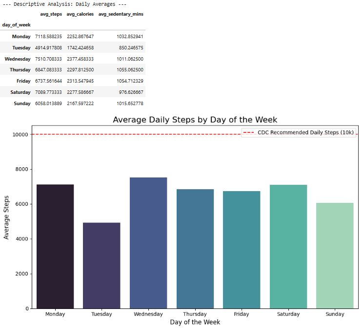

# Bellabeat Marketing Analysis: Unlocking Consumer Habits

**Description:** An analysis of smart device usage data to uncover consumer trends and guide marketing strategy for Bellabeat, a high-tech women's wellness company. This capstone project covers the full data analysis process from data preparation to high-level strategic recommendations.

---

## I. Introduction
Welcome to the Bellabeat data analysis case study. Bellabeat is a high-tech manufacturer of health-focused smart products for women. While currently a successful small company, Bellabeat has the potential to become a larger player in the global smart device market. 

This project follows the six steps of the data analysis process: **Ask, Prepare, Process, Analyze, Share, and Act** to analyze non-Bellabeat smart device fitness data. The resulting insights will be used to unlock new growth opportunities and inform future marketing strategies for the company.

## II. Ask
**Business Task:** Analyze non-Bellabeat smart device usage data to gain insights into how consumers are using their smart devices and apply these findings to one specific Bellabeat product to influence future marketing strategies.

**Primary Stakeholders:**
* **Urška Sršen:** Bellabeat's cofounder and Chief Creative Officer
* **Sando Mur:** Mathematician and Bellabeat's cofounder; key member of the Bellabeat executive team
* **Bellabeat Marketing Analytics Team**

## III. Prepare
**Data Source:** The data used for this analysis is the public [FitBit Fitness Tracker Data](https://www.kaggle.com/datasets/arashnic/fitbit) (CC0: Public Domain, dataset made available through Mobius). 

**Data Organization:** The dataset contains personal fitness tracking metrics from thirty consenting users, including minute-level output for physical activity, heart rate, and sleep monitoring. For this high-level consumer trend analysis, the `dailyActivity_merged.csv` dataset was utilized to observe daily habits regarding steps, caloric burn, and sedentary behavior.

## IV. Process
**Tools Used:** Python (Pandas, NumPy) for data cleaning and manipulation, and Matplotlib/Seaborn for exploratory data analysis (EDA) and data visualization. The processing was conducted within a Kaggle Notebook.

**Data Cleaning & Transformation Steps:**
1. Standardized column names to lowercase for consistency and ease of use.
2. Converted the `activitydate` column from string format to `datetime` objects.
3. Engineered a new feature, `day_of_week`, extracted from the date to analyze weekly behavioral trends.
4. Checked for and removed duplicate entries to ensure data integrity.
5. Verified the absence of null/missing values.

## V. Analyze & Share
The descriptive analysis focused on aggregating user activity by the day of the week to identify recurring behavioral patterns. The summarized results have been exported and can be reviewed here: [`./results/daily_activity_summary.csv`](./results/daily_activity_summary.csv).

### Key Insights Discovered:
* **The 10k Step Gap:** The average user in this dataset is failing to meet the CDC-recommended 10,000 steps per day across all days of the week. 
* **Mid-Week Peak vs. Tuesday Slump:** Activity peaks on Wednesdays (averaging 7,510 steps) and Mondays (7,118 steps). Conversely, Tuesdays show a dramatic drop in activity, averaging only 4,914 steps.
* **High Sedentary Behavior:** Users consistently log an average of roughly 1,000 sedentary minutes (over 16 hours) per day. This indicates a user base that likely works desk jobs or has highly stationary daily routines.
* **Inconsistent Caloric Burn:** Caloric burn directly mirrors step count, dipping significantly on Tuesdays and Sundays, suggesting users lack a consistent daily exercise routine.

### Visualizing the Trends
The following visualization highlights the daily average step count, clearly illustrating the variance in user activity throughout the week against the 10,000-step baseline.

## VI. Act (Strategic Recommendations)
Based on the analysis of the FitBit consumer data, I recommend the following marketing strategies focusing on the **Bellabeat App** and the **Bellabeat Leaf** wellness tracker:

1. **Implement "Tuesday Slump" Push Campaigns:** Since Tuesdays show the lowest activity levels, Bellabeat should utilize push notifications via the Bellabeat app on Tuesday mornings. These notifications could offer quick 10-minute desk-workout videos or motivational quotes to encourage movement during their least active day.

2. **Sedentary Time Alerts:** Because users are sitting for over 16 hours a day, the Bellabeat Leaf should be programmed to gently vibrate or send a smartphone alert after 2 hours of continuous inactivity. Marketing campaigns should highlight this "gentle nudge" feature as the perfect wellness solution for busy professionals.

3. **Progressive Goal Setting:** Because users are far from the 10,000-step goal (averaging closer to 6,000), marketing 10k steps immediately might be discouraging. Bellabeat should introduce a "dynamic step goal" feature in the app that gradually increases a user's daily goal from 5,000 steps up to 10,000 over a 30-day period.

---

### Author
**Samuel Situmeang** 
Institut Teknologi Del  
Email: samsitumeang@gmail.com / samuel.situmeang@del.ac.id